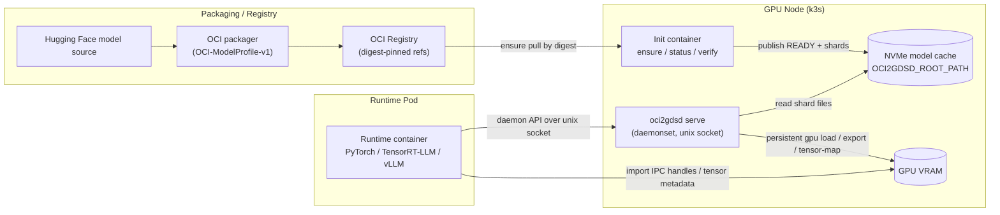
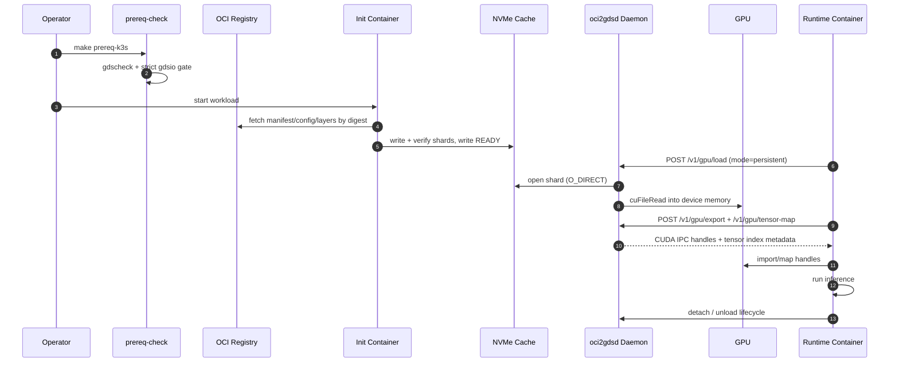

# oci2gdsd Architecture Diagram

This document gives a visual map of how `oci2gdsd` moves model bytes from OCI
registries to node-local storage and then into GPU memory through strict
GPUDirect Storage (GDS)-oriented flows.

## 1) System Topology (DaemonSet Path)

## 2) Control/Data Plane Split

- Control plane:
  - `ensure`, `status`, `verify`, `release`, `gc`
  - daemon lifecycle APIs (`/v1/gpu/attach`, `/v1/gpu/heartbeat`, `/v1/gpu/detach`)
- Data plane:
  - shard bytes on NVMe (`shards/` under published model path)
  - GDS read path (`O_DIRECT` + cuFile) into GPU allocations
  - runtime-side tensor binding/import from daemon-exported metadata

## 3) End-to-End Sequence (Strict GDS-Oriented)

## 4) Deployment Modes in Repo

- Local CLI mode (`make verify-local`):
  - no GPU, no Kubernetes; validates lifecycle guarantees only.
- Host strict probe mode (`./platform/host/scripts/quick-qwen.sh`):
  - host-only direct-GDS qualification/probe.
- k3s daemonset mode (`make verify-k3s-{qwen,tensor,vllm}`):
  - node daemon + runtime workloads (PyTorch, TensorRT-LLM, vLLM).

## 5) Runtime Tracks

- PyTorch:
  - daemon-client checks and qwen workload path.
- TensorRT-LLM:
  - daemon-client parity checks and runtime integration gate.
- vLLM:
  - daemon-client parity checks and loader/inference integration gate.

## 6) Related Docs

- [daemonset-manifest-guide.md](daemonset-manifest-guide.md)
- [direct-gds-runbook.md](direct-gds-runbook.md)
- [troubleshooting.md](troubleshooting.md)
- [../platform/k3s/README.md](../platform/k3s/README.md)
- [../platform/host/README.md](../platform/host/README.md)
